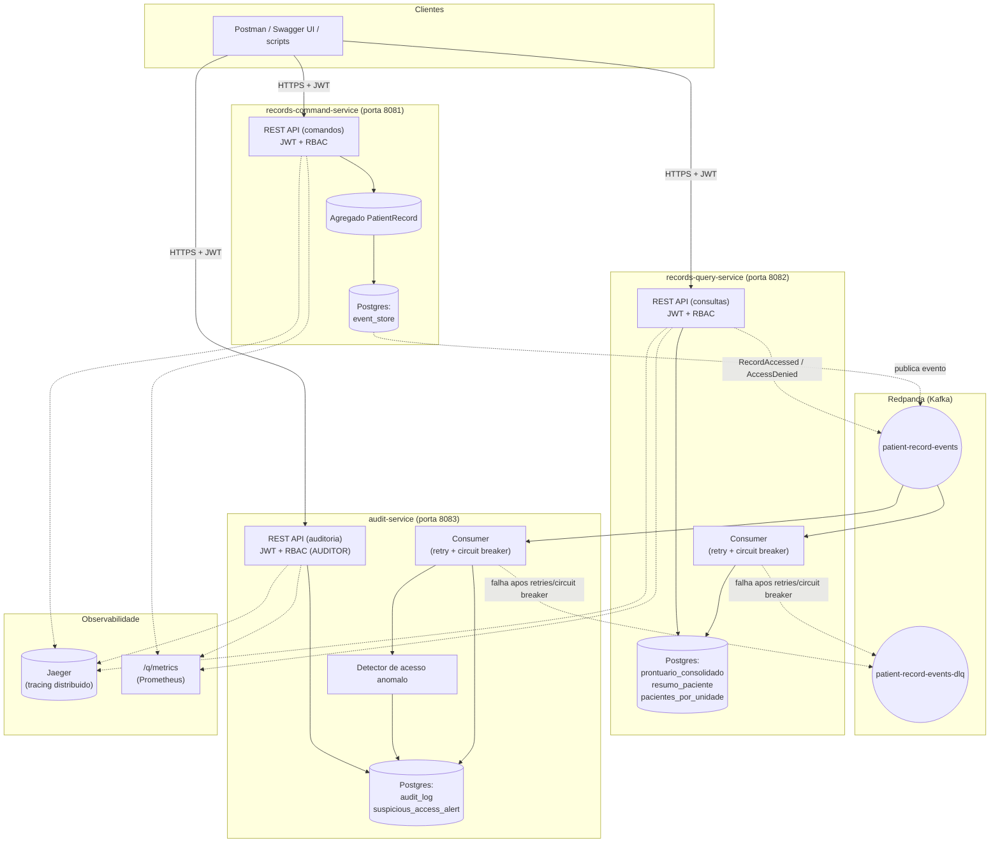

# Arquitetura — Prontuário Eletrônico Unificado SUS

Referente à issue [#18 - README e diagrama de arquitetura](https://github.com/irvinglucas/tech-challenge-fiap-phase-5/issues/18). Complementa o [event storming do domínio](event-storming.md), que descreve o *quê* (eventos, comandos, políticas); este documento descreve o *como* (serviços, infraestrutura, comunicação, atributos de qualidade).

## Visão geral

O sistema é dividido em **3 microsserviços independentes** (cada um uma aplicação [Quarkus](https://quarkus.io/) própria, com seu próprio banco de dados — *database per service*), comunicando-se de forma assíncrona via eventos de domínio publicados num broker compatível com Kafka (Redpanda). A separação segue **CQRS**: o lado de escrita (`records-command-service`) é a fonte da verdade via **Event Sourcing**; o lado de leitura (`records-query-service`) mantém projeções desnormalizadas otimizadas para consulta; e a auditoria (`audit-service`) consome o mesmo fluxo de eventos para construir uma trilha de governança independente.

## Os 3 serviços

### `records-command-service` (porta 8081) — write side

- **Responsabilidade**: único ponto de escrita do domínio. Valida as regras de negócio do agregado `PatientRecord` (ver [event-storming.md](event-storming.md)) e persiste cada mudança como um evento imutável no *event store* (Event Sourcing).
- **Estado**: reconstruído a cada comando via replay dos eventos do paciente (sem snapshot — volume de eventos por paciente é pequeno o suficiente para o MVP).
- **Concorrência**: controle otimista por versão do agregado (`ConcurrencyConflictException` em caso de conflito).
- **Publica**: todo evento de domínio gerado é publicado no tópico Kafka `patient-record-events`, com o `correlationId` da requisição HTTP propagado como header.
- **Segurança**: endpoints protegidos por JWT + RBAC (`MEDICO`, `ENFERMEIRO`, `GESTOR`); inclui um emissor de tokens de demonstração (`POST /dev/tokens`) para uso local/hackathon.
- **Banco**: Postgres próprio (`records_command`), tabela única `event_store` (append-only).

### `records-query-service` (porta 8082) — read side

- **Responsabilidade**: mantém projeções de leitura desnormalizadas, atualizadas de forma assíncrona ao consumir `patient-record-events`. Nenhuma projeção é fonte da verdade — pode ser reconstruída do zero reprocessando o tópico.
- **Projeções**: `prontuario_consolidado` (timeline completa), `resumo_paciente` (visão agregada: alergias, diagnósticos ativos, últimas prescrições) e `pacientes_por_unidade` (para listagem e controle de acesso).
- **Controle de acesso na leitura**: a query `ViewPatientRecord` verifica se o profissional tem um `AccessGranted` ativo para o paciente; publica `RecordAccessed` (autorizado) ou `AccessDenied` (negado) de volta no mesmo tópico, para consumo pelo `audit-service`.
- **Resiliência**: consumidor Kafka com `@Retry` + `@CircuitBreaker` (SmallRye Fault Tolerance); eventos que continuam falhando vão para a DLQ `patient-record-events-dlq` sem travar o consumo do restante do tópico.
- **Banco**: Postgres próprio (`records_query`).

### `audit-service` (porta 8083) — auditoria e governança

- **Responsabilidade**: trilha de auditoria append-only de todo evento do domínio (alterações e acessos), independente do `records-query-service`. Implementa a detecção de acesso anômalo (evento derivado `SuspiciousAccessDetected`): alerta quando um profissional acessa muitos pacientes distintos em várias unidades numa janela curta de tempo.
- **Consome**: o mesmo tópico `patient-record-events`, com a mesma estratégia de resiliência (retry + circuit breaker + DLQ) do `records-query-service`.
- **Expõe**: trilha completa por paciente, "quem acessou o quê" e a lista de alertas de acesso anômalo — restrito à role `AUDITOR`.
- **Banco**: Postgres próprio (`audit`), tabelas `audit_log` e `suspicious_access_alert`.

## Comunicação entre serviços

Os 3 serviços **nunca se chamam diretamente via HTTP** — toda comunicação entre eles é assíncrona, via o tópico Kafka `patient-record-events` (e sua DLQ). Isso permite que cada serviço escale, falhe e seja reiniciado de forma independente, e que novos consumidores (ex.: um futuro serviço de notificações) sejam adicionados sem alterar o `records-command-service`.

| De | Para | Mecanismo |
|---|---|---|
| `records-command-service` | `records-query-service`, `audit-service` | Publica em `patient-record-events` (Kafka) |
| `records-query-service` | `audit-service` | Publica `RecordAccessed`/`AccessDenied` no mesmo tópico `patient-record-events` |
| Qualquer serviço | Qualquer serviço | Nunca via REST síncrono — apenas os clientes externos (Postman/Swagger) chamam os endpoints REST |

## Atributos de qualidade (não funcionais)

| Atributo | Como é atendido |
|---|---|
| **Segurança** | JWT assinado (RSA) + RBAC por endpoint (`@RolesAllowed`); identidade do profissional sempre extraída do token (`sub`), nunca do corpo da requisição |
| **Auditabilidade** | Todo evento de domínio (alteração ou acesso) é gravado de forma append-only no `audit-service`, desacoplado do event store de escrita |
| **Observabilidade** | Métricas Prometheus (`/q/metrics`) e health checks (`/q/health`) nos 3 serviços; logs estruturados em JSON com `correlationId` propagado via HTTP e headers Kafka; tracing distribuído via OpenTelemetry + Jaeger, cobrindo requisições HTTP e consumo Kafka |
| **Resiliência** | Retry + circuit breaker (SmallRye Fault Tolerance) nos consumidores Kafka; eventos que continuam falhando vão para uma DLQ dedicada em vez de travar o tópico |
| **Consistência eventual** | Aceita entre a escrita (`records-command-service`) e as projeções de leitura/auditoria — inerente ao CQRS + Event Sourcing; a UI (ou cliente) deve tolerar um pequeno delay entre um comando e sua reflexão nas consultas |
| **Escalabilidade horizontal** | Serviços *stateless* (todo estado vive no Postgres/Kafka) — podem ser escalados horizontalmente via `docker compose up --scale <servico>=N`; consumidores Kafka dividem partições entre réplicas do mesmo consumer group, e as redistribuem automaticamente se uma réplica cair. Demonstrado e documentado com evidência real em [docs/scalability-demo.md](scalability-demo.md) |

## Stack técnica

- **Linguagem/Framework**: Java 21 + Quarkus 3.37
- **Persistência**: PostgreSQL 16 (um schema por serviço), Flyway para migrações
- **Mensageria**: Redpanda (compatível com Kafka), SmallRye Reactive Messaging
- **Segurança**: SmallRye JWT (RSA)
- **Resiliência**: SmallRye Fault Tolerance (retry, circuit breaker)
- **Observabilidade**: Micrometer + Prometheus, OpenTelemetry + Jaeger, logging JSON estruturado
- **Build**: Maven multi-módulo (`common`, `records-command-service`, `records-query-service`, `audit-service`)
- **Infra local**: Docker Compose ([infra/docker-compose.yml](../infra/docker-compose.yml))

## Onde ver cada coisa em ação

- **Redpanda Console** (tópicos, mensagens, consumer groups): `http://localhost:8080`
- **Jaeger UI** (traces distribuídos entre os 3 serviços): `http://localhost:16686`
- **Swagger UI** de cada serviço: `http://localhost:<porta>/q/swagger-ui`
- **Coleção Postman** com o fluxo completo: [docs/postman](postman/)
- **Teste de integração ponta a ponta**: [scripts/integration-test.sh](../scripts/integration-test.sh)
