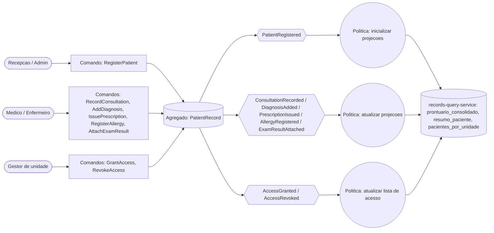
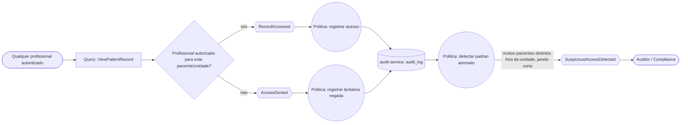

# Event Storming — Prontuário Eletrônico Unificado SUS

Referente à issue [#1 - Event storming do domínio de prontuário](https://github.com/irvinglucas/tech-challenge-fiap-phase-5/issues/1).

Este documento registra o event storming leve do domínio, base para o desenho do `records-command-service`, `records-query-service` e `audit-service`.

## Objetivo do domínio

Centralizar o histórico clínico de um paciente entre unidades do SUS, permitindo que profissionais autorizados consultem dados atualizados de forma segura, com trilha de auditoria completa de todo acesso e alteração.

## Atores / Personas

| Ator | Papel |
|---|---|
| Recepção / Admin de unidade | Registra o paciente no sistema |
| Médico | Registra consultas, diagnósticos, prescrições, alergias, resultados de exame |
| Enfermeiro | Registra evoluções clínicas e alergias (escopo mais restrito que o médico) |
| Gestor de unidade | Concede/revoga acesso de profissionais ao prontuário de um paciente |
| Auditor / Compliance (governança) | Consulta a trilha de auditoria e investiga acessos suspeitos |

## Agregado

**`PatientRecord`** (chave: `patientId`) — concentra todo o histórico clínico do paciente e a lista de profissionais/unidades autorizados a acessá-lo. É o único agregado de escrita do domínio; todo comando abaixo opera sobre ele e toda leitura consolidada é uma projeção construída a partir dos seus eventos.

## Eventos de domínio e comandos correspondentes

| # | Comando | Ator | Pré-condição | Evento gerado |
|---|---|---|---|---|
| 1 | `RegisterPatient` | Recepção / Admin | CPF do paciente ainda não registrado | `PatientRegistered` |
| 2 | `RecordConsultation` | Médico / Enfermeiro | Paciente registrado; profissional com acesso concedido | `ConsultationRecorded` |
| 3 | `AddDiagnosis` | Médico | Paciente registrado; profissional com acesso concedido | `DiagnosisAdded` |
| 4 | `IssuePrescription` | Médico | Paciente registrado; profissional com acesso concedido | `PrescriptionIssued` |
| 5 | `RegisterAllergy` | Médico / Enfermeiro | Paciente registrado; profissional com acesso concedido | `AllergyRegistered` |
| 6 | `AttachExamResult` | Médico / Enfermeiro | Paciente registrado; profissional com acesso concedido | `ExamResultAttached` |
| 7 | `GrantAccess` | Gestor de unidade | Paciente registrado | `AccessGranted` |
| 8 | `RevokeAccess` | Gestor de unidade | Acesso previamente concedido | `AccessRevoked` |
| 9 | `ViewPatientRecord` (query) | Qualquer profissional autenticado | — | `RecordAccessed` (autorizado) **ou** `AccessDenied` (não autorizado) |

Os comandos 2 a 6 (evolução clínica) compartilham as mesmas pré-condições e o mesmo perfil de autorização — na prática, o `records-command-service` os valida com a mesma política de acesso do agregado `PatientRecord`.

## Políticas (reações automáticas a eventos)

| Evento disparador | Política | Reação |
|---|---|---|
| `PatientRegistered` | Inicializar projeções | `records-query-service` cria a entrada inicial em `prontuario_consolidado`, `resumo_paciente` e `pacientes_por_unidade` |
| `ConsultationRecorded`, `DiagnosisAdded`, `PrescriptionIssued`, `AllergyRegistered`, `ExamResultAttached` | Atualizar projeções | `records-query-service` atualiza as mesmas três projeções |
| `AccessGranted` / `AccessRevoked` | Atualizar lista de acesso | `records-query-service` atualiza quem pode ser listado em `pacientes_por_unidade` para aquele profissional |
| `RecordAccessed` | Registrar acesso | `audit-service` grava o acesso no `audit_log` |
| `AccessDenied` | Registrar tentativa negada | `audit-service` grava a tentativa no `audit_log` |
| `RecordAccessed` (agregado por profissional/janela de tempo) | Detectar acesso anômalo | Se um profissional acessa muitos pacientes distintos fora da sua unidade em uma janela curta, `audit-service` emite `SuspiciousAccessDetected` (diferencial de inovação/governança) |

`SuspiciousAccessDetected` é um evento derivado, produzido pelo próprio `audit-service` a partir da política acima (não é emitido pelo agregado `PatientRecord`).

## Diagrama — fluxo clínico (escrita e leitura)

## Diagrama — fluxo de acesso e governança

## Eventos consumidos por serviço

| Evento | `records-query-service` | `audit-service` |
|---|---|---|
| `PatientRegistered` | Cria projeções iniciais | — |
| `ConsultationRecorded` | Atualiza projeções | — |
| `DiagnosisAdded` | Atualiza projeções | — |
| `PrescriptionIssued` | Atualiza projeções | — |
| `AllergyRegistered` | Atualiza projeções | — |
| `ExamResultAttached` | Atualiza projeções | — |
| `AccessGranted` | Atualiza `pacientes_por_unidade` | — |
| `AccessRevoked` | Atualiza `pacientes_por_unidade` | — |
| `RecordAccessed` | — | Grava no `audit_log`; alimenta detecção de anomalia |
| `AccessDenied` | — | Grava no `audit_log` |
| `SuspiciousAccessDetected` (derivado) | — | Disponível na consulta de auditoria/alertas |

## Próximos passos

Este desenho alimenta diretamente as próximas issues do milestone M1 (scaffold do repositório e infra local) e M2 (implementação do `records-command-service` com o agregado `PatientRecord` e os comandos acima).
